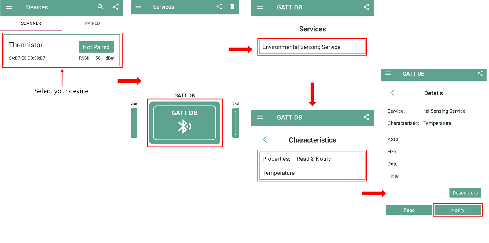
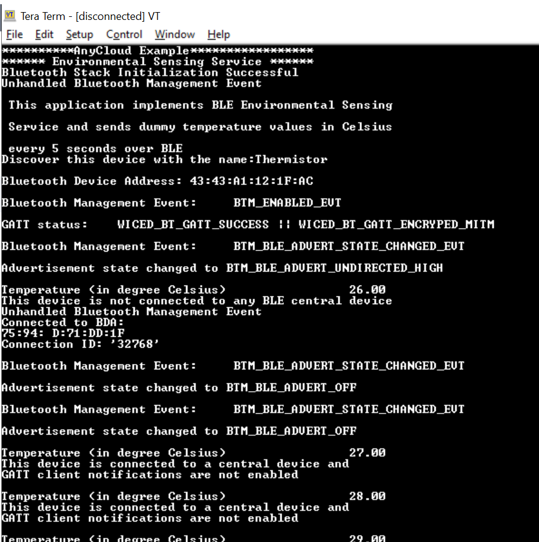
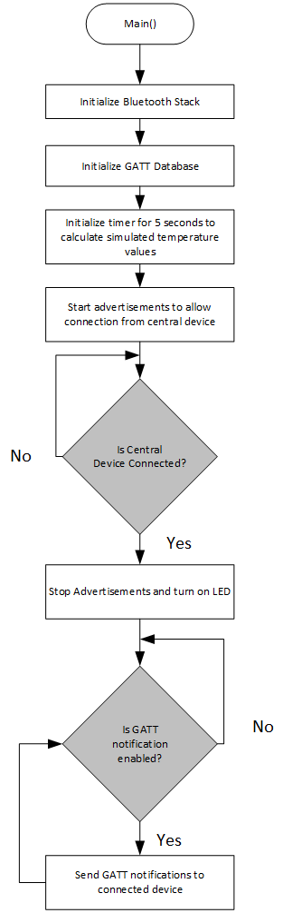

# Bluetooth&reg; LE environmental sensing service

This code example demonstrates the implementation of a simple Bluetooth&reg; LE environmental sensing profile. It shows how to send environmental parameters like temperature by sending simulated temperature values over the Bluetooth&reg; LE connection using AIROC&trade; CYW20829 Wi-Fi & Bluetooth&reg; combo SoCs. Instructions provided in this document are applicable for all supported kits in the ModusToolbox&trade; software environment.

[View this README on GitHub.](https://github.com/Infineon/mtb-example-btstack-freertos-ess)

[Provide feedback on this code example.](https://cypress.co1.qualtrics.com/jfe/form/SV_1NTns53sK2yiljn?Q_EED=eyJVbmlxdWUgRG9jIElkIjoiQ0UyMzAyOTQiLCJTcGVjIE51bWJlciI6IjAwMi0zMDI5NCIsIkRvYyBUaXRsZSI6IkJsdWV0b290aCZyZWc7IExFIGVudmlyb25tZW50YWwgc2Vuc2luZyBzZXJ2aWNlIiwicmlkIjoicmFubSIsIkRvYyB2ZXJzaW9uIjoiNC4yLjAiLCJEb2MgTGFuZ3VhZ2UiOiJFbmdsaXNoIiwiRG9jIERpdmlzaW9uIjoiTUNEIiwiRG9jIEJVIjoiSUNXIiwiRG9jIEZhbWlseSI6IlBTT0MifQ==)

## Requirements

- [ModusToolbox&trade; software](https://www.infineon.com/modustoolbox) v3.0 or later (tested with v3.0)
- Programming language: C
- Board support package (BSP) minimum required version for:
   - PSoC&trade; 6 MCU: v4.0.0
   - CYW920829M2EVB-01: v1.0.0.Beta1
- Associated parts: [PSoC&trade; 6 MCU](https://www.infineon.com/cms/en/product/microcontroller/32-bit-psoc-arm-cortex-microcontroller/psoc-6-32-bit-arm-cortex-m4-mcu) parts with AIROC&trade; CYW43012 Wi-Fi & Bluetooth&reg; combo chip, AIROC&trade; CYW43012 Wi-Fi & Bluetooth&reg; combo chip, and [AIROC&trade; CYW20829 Bluetooth&reg; LE SoC](https://www.infineon.com/cms/en/product/promopages/airoc20829)

## Supported toolchains (make variable 'TOOLCHAIN')

- GNU Arm&reg; embedded compiler v10.3.1 (`GCC_ARM`) - Default value of `TOOLCHAIN`
- Arm&reg; compiler v6.16 (`ARM`)
- IAR C/C++ compiler v9.30.1 (`IAR`)

## Supported kits (make variable 'TARGET')

- [PSoC&trade; 6 Wi-Fi Bluetooth&reg; prototyping kit](https://www.infineon.com/CY8CPROTO-062-4343W) (`CY8CPROTO-062-4343W`) – Default value of `TARGET`
- [PSoC&trade; 62S3 Wi-Fi Bluetooth&reg; prototyping kit](https://www.infineon.com/CY8CPROTO-062S3-4343W) (`CY8CPROTO-062S3-4343W`)
- [PSoC&trade; 62S2 Wi-Fi Bluetooth&reg; pioneer kit](https://www.infineon.com/CY8CKIT-062S2-43012) (`CY8CKIT-062S2-43012`)
- [PSoC&trade; 62S1 Wi-Fi Bluetooth&reg; pioneer kit](https://www.infineon.com/CYW9P62S1-43012EVB-01) (`CYW9P62S1-43012EVB-01`)
- [PSoC&trade; 6 Wi-Fi Bluetooth&reg; pioneer kit](https://www.infineon.com/CY8CKIT-062-WIFI-BT) (`CY8CKIT-062-WIFI-BT`)
- [PSoC&trade; 62S1 Wi-Fi Bluetooth&reg; pioneer kit](https://www.infineon.com/CYW9P62S1-43438EVB-01) (`CYW9P62S1-43438EVB-01`)
- [PSoC&trade; 64 "Secure Boot" Wi-Fi Bluetooth&reg; pioneer kit](https://www.infineon.com/CY8CKIT-064B0S2-4343W) (`CY8CKIT-064B0S2-4343W`)
- [PSoC&trade; 62S2 evaluation kit](https://www.infineon.com/CY8CEVAL-062S2) (`CY8CEVAL-062S2`, `CY8CEVAL-062S2-LAI-4373M2`, `CY8CEVAL-062S2-LAI-43439M2`)
- AIROC&trade; CYW20829 Bluetooth&reg; LE evaluation kit (`CYW920829M2EVB-01`)
- [PSoC&trade; 6 Bluetooth&reg; LE pioneer kit](https://www.infineon.com/CY8CKIT-062-BLE) (`CY8CKIT-062-BLE`)
- [PSoC&trade; 6 Bluetooth&reg; LE prototyping kit](https://www.infineon.com/CY8CPROTO-063-BLE) (`CY8CPROTO-063-BLE`)
- [EZ-BLE Arduino Evaluation Board](https://www.infineon.com/cms/en/product/evaluation-boards/cyble-416045-eval/) (`CYBLE-416045-EVAL`)
- [PSoC&trade; 62S2 Wi-Fi Bluetooth&reg; prototyping kit](https://www.infineon.com/CY8CPROTO-062-43439) (`CY8CPROTO-062S2-43439`)

## Hardware setup

This example uses the board's default configuration. See the kit user guide to ensure that the board is configured correctly.

**Note:** The PSoC&trade; 6 Bluetooth&reg; LE pioneer kit (CY8CKIT-062-BLE) and the PSoC&trade; 6 Wi-Fi Bluetooth&reg; pioneer kit (CY8CKIT-062-WIFI-BT) ship with KitProg2 installed. The ModusToolbox&trade; software requires KitProg3. Before using this code example, make sure that the board is upgraded to KitProg3. The tool and instructions are available in the [Firmware Loader](https://github.com/Infineon/Firmware-loader) GitHub repository. If you do not upgrade, you will see an error like "unable to find CMSIS-DAP device" or "KitProg firmware is out of date".

The AIROC&trade; CYW20829 Bluetooth&reg; kit (CYW920829M2EVB-01) ships with KitProg3 version 2.30 installed. The ModusToolbox&trade; software requires KitProg3 with latest version 2.40. Before using this code example, make sure that the board is upgraded to KitProg3. The tool and instructions are available in the Firmware Loader GitHub repository. If you do not upgrade, you will see an error such as "unable to find CMSIS-DAP device" or "KitProg firmware is out of date".

## Software setup

This code example consists of two parts: a GAP Peripheral and a GAP Central.

For the Central, download and install the LightBlue&reg; app for [iOS](https://apps.apple.com/us/app/lightblue/id557428110) or [Android](https://play.google.com/store/apps/details?id=com.punchthrough.lightblueexplorer&gl=US).


Scan the following QR codes from your mobile phone to download the LightBlue&reg; app.


Install a terminal emulator if you don't have one. Instructions in this document use [Tera Term](https://ttssh2.osdn.jp/index.html.en).


## Using the code example

Create the project and open it using one of the following:

<details><summary><b>In Eclipse IDE for ModusToolbox&trade; software</b></summary>

1. Click the **New Application** link in the **Quick Panel** (or, use **File** > **New** > **ModusToolbox&trade; Application**). This launches the [Project Creator](https://www.infineon.com/ModusToolboxProjectCreator) tool.

2. Pick a kit supported by the code example from the list shown in the **Project Creator - Choose Board Support Package (BSP)** dialog.

   When you select a supported kit, the example is reconfigured automatically to work with the kit. To work with a different supported kit later, use the [Library Manager](https://www.infineon.com/ModusToolboxLibraryManager) to choose the BSP for the supported kit. You can use the Library Manager to select or update the BSP and firmware libraries used in this application. To access the Library Manager, click the link from the **Quick Panel**.

   You can also just start the application creation process again and select a different kit.

   If you want to use the application for a kit not listed here, you may need to update the source files. If the kit does not have the required resources, the application may not work.

3. In the **Project Creator - Select Application** dialog, choose the example by enabling the checkbox.

4. (Optional) Change the suggested **New Application Name**.

5. The **Application(s) Root Path** defaults to the Eclipse workspace which is usually the desired location for the application. If you want to store the application in a different location, you can change the *Application(s) Root Path* value. Applications that share libraries should be in the same root path.

6. Click **Create** to complete the application creation process.

For more details, see the [Eclipse IDE for ModusToolbox&trade; software user guide](https://www.infineon.com/MTBEclipseIDEUserGuide) (locally available at *{ModusToolbox&trade; software install directory}/docs_{version}/mt_ide_user_guide.pdf*).

</details>

<details><summary><b>In command-line interface (CLI)</b></summary>

ModusToolbox&trade; software provides the Project Creator as both a GUI tool and the command line tool, "project-creator-cli". The CLI tool can be used to create applications from a CLI terminal or from within batch files or shell scripts. This tool is available in the *{ModusToolbox&trade; software install directory}/tools_{version}/project-creator/* directory.

Use a CLI terminal to invoke the "project-creator-cli" tool. On Windows, use the command line "modus-shell" program provided in the ModusToolbox&trade; software installation instead of a standard Windows command-line application. This shell provides access to all ModusToolbox&trade; software tools. You can access it by typing `modus-shell` in the search box in the Windows menu. In Linux and macOS, you can use any terminal application.

The "project-creator-cli" tool has the following arguments:

Argument | Description | Required/optional
---------|-------------|-----------
`--board-id` | Defined in the `<id>` field of the [BSP](https://github.com/Infineon?q=bsp-manifest&type=&language=&sort=) manifest | Required
`--app-id`   | Defined in the `<id>` field of the [CE](https://github.com/Infineon?q=ce-manifest&type=&language=&sort=) manifest | Required
`--target-dir`| Specify the directory in which the application is to be created if you prefer not to use the default current working directory | Optional
`--user-app-name`| Specify the name of the application if you prefer to have a name other than the example's default name | Optional

<br>

The following example clones the "[Bluetooth&reg; LE environmental sensing service](https://github.com/Infineon/mtb-example-btstack-freertos-ess)" application with the desired name "ess" configured for the *CY8CKIT-062-WIFI-BT* BSP into the specified working directory, *C:/mtb_projects*:

   ```
   project-creator-cli --board-id CY8CKIT-062-WIFI-BT --app-id mtb-example-btstack-freertos-ble-ess --user-app-name ess--target-dir "C:/mtb_projects"
   ```

**Note:** The project-creator-cli tool uses the `git clone` and `make getlibs` commands to fetch the repository and import the required libraries. For details, see the "Project creator tools" section of the [ModusToolbox&trade; software user guide](https://www.infineon.com/ModusToolboxUserGuide) (locally available at *{ModusToolbox&trade; software install directory}/docs_{version}/mtb_user_guide.pdf*).

To work with a different supported kit later, use the [Library Manager](https://www.infineon.com/ModusToolboxLibraryManager) to choose the BSP for the supported kit. You can invoke the Library Manager GUI tool from the terminal using `make library-manager` command or use the Library Manager CLI tool "library-manager-cli" to change the BSP.

The "library-manager-cli" tool has the following arguments:

Argument | Description | Required/optional
---------|-------------|-----------
`--add-bsp-name` | Name of the BSP that should be added to the application | Required
`--set-active-bsp` | Name of the BSP that should be as active BSP for the application | Required
`--add-bsp-version`| Specify the version of the BSP that should be added to the application if you do not wish to use the latest from manifest | Optional
`--add-bsp-location`| Specify the location of the BSP (local/shared) if you prefer to add the BSP in a shared path | Optional

<br />

The following example adds the CY8CPROTO-062-4343W BSP to the already created application and makes it the active BSP for the app:

   ```
   library-manager-cli --project "C:/mtb_projects/ess" --add-bsp-name CY8CPROTO-062-4343W --add-bsp-version "latest-v4.X" --add-bsp-location "local"

   library-manager-cli --project "C:/mtb_projects/ess" --set-active-bsp APP_CY8CPROTO-062-4343W
   ```

</details>

<details><summary><b>In third-party IDEs</b></summary>

Use one of the following options:

- **Use the standalone [Project Creator](https://www.infineon.com/ModusToolboxProjectCreator) tool:**

   1. Launch Project Creator from the Windows Start menu or from *{ModusToolbox&trade; software install directory}/tools_{version}/project-creator/project-creator.exe*.

   2. In the initial **Choose Board Support Package** screen, select the BSP, and click **Next**.

   3. In the **Select Application** screen, select the appropriate IDE from the **Target IDE** drop-down menu.

   4. Click **Create** and follow the instructions printed in the bottom pane to import or open the exported project in the respective IDE.

<br>

- **Use command-line interface (CLI):**

   1. Follow the instructions from the **In command-line interface (CLI)** section to create the application.

   2. Export the application to a supported IDE using the `make <ide>` command.

   3. Follow the instructions displayed in the terminal to create or import the application as an IDE project.

For a list of supported IDEs and more details, see the "Exporting to IDEs" section of the [ModusToolbox&trade; software user guide](https://www.infineon.com/ModusToolboxUserGuide) (locally available at *{ModusToolbox&trade; software install directory}/docs_{version}/mtb_user_guide.pdf*).

</details>

## Operation

1. Connect the board to your PC using the provided USB cable through the KitProg3 USB connector.

2. Open a terminal program and select the KitProg3 COM port. Set the serial port parameters to 8N1 and 115200 baud.

3. Program the board using one of the following:

   <details><summary><b>Using Eclipse IDE for ModusToolbox&trade; software</b></summary>

      1. Select the application project in the Project Explorer.

      2. In the **Quick Panel**, scroll down, and click **\<Application Name> Program (KitProg3_MiniProg4)**.
   </details>

   <details><summary><b>Using CLI</b></summary>

     From the terminal, execute the `make program` command to build and program the application using the default toolchain to the default target. The default toolchain is specified in the application's Makefile but you can override this value manually:
      ```
      make program TOOLCHAIN=<toolchain>
      ```

      Example:
      ```
      make program TOOLCHAIN=GCC_ARM
      ```
   </details>

   **Note**: Before building the application, ensure that the *deps* folder contains the BSP file (*TARGET_xxx.lib*) corresponding to the TARGET. Execute the `make getlibs` command to fetch the BSP contents before building the application.

4. After programming, the application starts automatically. Confirm that "\<CE Title>" is displayed on the UART terminal.

5. To test using the LightBlue&reg; mobile app, do the following (see equivalent LightBlue&reg; app screenshots in Figure 1):

    1. Turn ON Bluetooth&reg; on your Android or iOS device.

    2. Launch the LightBlue&reg; app.

    3. Press the reset switch on the supported kit to start sending advertisements.

    4. Swipe down on the LightBlue&reg; app home screen to start scanning for Bluetooth&reg; LE Peripherals; your device ("Thermistor") appears in the LightBlue&reg; app home screen. Select your device to establish a Bluetooth&reg; LE connection. Once the connection is established, LED1 changes from OFF state to always ON state.

    5. Select **Environmental Sensing Service** and tap **SUBSCRIBE**.

         The temperature values will be updated every 5 seconds in representations such as HEX.

    **Figure 1. Testing with the LightBlue&reg; app on android**

    

6.  Use the KitProg3 COM port to view the Bluetooth&reg; stack and application trace messages in the terminal window.

    **Figure 2. Log messages on KitProg3 COM port**

    

## Debugging

You can debug the example to step through the code. In the IDE, use the **\<Application Name> Debug (KitProg3_MiniProg4)** configuration in the **Quick Panel**. For more details, see the "Program and debug" section in the [Eclipse IDE for ModusToolbox&trade; software user guide](https://www.infineon.com/dgdl/Infineon-Eclipse_IDE_for_ModusToolbox_User_Guide_1-UserManual-v01_00-EN.pdf?fileId=8ac78c8c7d718a49017d99bcb86331e8).

**Note:** **(Only while debugging PSoC&trade; 6 MCU)** On the CM4 CPU, some code in `main()` may execute before the debugger halts at the beginning of `main()`. This means that some code executes twice - once before the debugger stops execution, and again after the debugger resets the program counter to the beginning of `main()`. See [KBA231071](https://community.infineon.com/t5/Knowledge-Base-Articles/PSoC-6-MCU-Code-in-main-executes-before-the-debugger-halts-at-the-first-line-of/ta-p/253856) to learn about this and for the workaround. *{ModusToolbox&trade; software install directory}/ide_{version}/docs/mtb_ide_user_guide.pdf*.

## Design and implementation

### Resources and settings

This section explains the ModusToolbox&trade; software resources and their configuration as used in this code example. Note that all the configuration explained in this section has already been done in the code example. ModusToolbox&trade; software stores the device configuration settings of the application in the *design.modus* file and Bluetooth&reg; configuration settings of the application in the *design.cybt* file. This file is used by the graphical configurators, which generate the configuration firmware. This firmware is stored in the application’s *GeneratedSource* folder.

- **Device Configurator:** Used to enable/configure the peripherals and the pins used in the application. For detailed information on how to use it, see the
[Device Configurator guide](https://www.infineon.com/dgdl/Infineon-ModusToolbox_Device_Configurator_Guide_4-UserManual-v01_00-EN.pdf?fileId=8ac78c8c7d718a49017d99ab297631cb).

- **Bluetooth&reg; Configurator:** Used for generating/modifying the Bluetooth&reg; LE GATT database. For detailed information on how to use it, see the [Bluetooth&reg; Configurator guide](https://www.infineon.com/dgdl/Infineon-ModusToolbox_Bluetooth_Configurator_Guide_3-UserManual-v01_00-EN.pdf?fileId=8ac78c8c7d718a49017d99aaf5b231be).

**Note:** For PSoC&trade; 6 Bluetooth&reg; LE-based BSPs(CY8CKIT-062-BLE, CY8CPROTO-063-BLE, and CYBLE-416045-EVAL) with support for AIROC&trade; BTSTACK, if you want to use the bt-configurator tool, select the *AIROC&trade; BTSTACK with Bluetooth&reg; LE only (CYW20829, PSoC&trade; 6 with CYW43xxx Connectivity device)* option from the drop-down to select the device. Do not use the *PSoC&trade; Bluetooth&reg; LE Legacy Stack (PSoC&trade; 6-BLE)* option because it is not compatible with AIROC&trade; BTSTACK.

This code example is written in a way that is generic across multiple devices and platforms. The code example application runs on the Arm&reg; Cortex&reg; core of the MCU device. The functionality of the code example will remain the same on all the supported kits; the application was developed using the ModusToolbox&trade; software.

This application demonstrates the Bluetooth&reg; LE peripheral capability of the supported kit. The simulated temperature value is sent over Bluetooth&reg; LE to a Central device, and to the UART as debug trace messages. This project demonstrates the following features:

- Bluetooth&reg; LE Environment Sensing Service (ESS) – GATT Read and Notify functionality
- Debug trace messages
- Connection with one Central device
- Connection status indication through LED

The project consists of the following files:

**Table 1. Important user-application-related source files**

|**File name**|**Comments**|
|-----------------------------------|-------------------------------------------------------|
|*main.c* | Contains the `main()` function, which is the entry point for execution of the user application code after device startup.|
|*cycfg_bt_settings.c, cycfg_bt_settings.h* |    Contain the runtime Bluetooth&reg; stack configuration parameters such as device name and  advertisement/ connection settings. Note that the name that the device uses for advertising (“Thermistor”) is defined in *app_bt_cfg.c*.|
|*app_bt_gatt_handler.c, app_bt_gatt_handler.h*|Contain the code for the Bluetooth&reg; stack GATT event handler functions. |
|*cycfg_gatt_db.c, cycfg_gatt_db.h*|    Contain the GATT database information generated using the Bluetooth&reg; configurator tool. These files reside in the *GeneratedSource* folder under the application folder.|

#### Flowchart

**Figure 3. Bluetooth&reg; LE environmental sensing service application**



This flowchart provides an overview of the Environmental Sensing Profile application. The Environmental Sensing Profile in this application consists of one of the Bluetooth&reg; SIG-defined services, namely the "Environment Sensing Service" (ESS). This project implements only the Temperature characteristic from the Environmental Sensing service. This characteristic supports notification and read operations, which allow the GATT Server to send data to the connected GATT Client device whenever new data is available, and a read to be performed from the GATT Client device.

The Bluetooth&reg; Configurator provided by ModusToolbox&trade; software makes it easier to design and implement the GATT DB. The Bluetooth&reg; Configurator generates the *cycfg_gatt_db.c* and *cycfg_gatt_db.h* files. All Environmental Sensing profile-related variables and functions are contained in these files. When the GATT DB is initialized after Bluetooth&reg; stack initialization, all profile-related values will be ready to be advertised to the Central device. See the *ModusToolbox&trade; software Bluetooth&reg; Configurator guide* for details.

The code example generates dummy temperature values between 20 degree and 30 degree celsius. Every 5 seconds, the temperature varies by 1 degree celsius. A timer callback gives this simulated temperature value, which is then sent every 5 seconds to the Central device when connected and GATT notifications are enabled by the Central.

When the Peripheral device is connected, LED1 will be ON; when it is disconnected, LED1 will be OFF. To turn the LED ON and OFF, generic GPIO functions are used to drive the output pin HIGH or LOW. The LEDs present in the supported kits are active LOW LEDs, which means that the LED turns ON when the GPIO is driven LOW.

The *app_bt_gatt_handler.c* and *app_bt_gatt_handler.h* files handle the functionality of GATT callbacks from the Central device. On receiving a connection request, the Bluetooth&reg; stack gives a GATT event to the application of `wiced_bt_gatt_evt_t` type.

For example, the LED toggle functionality is implemented in the GATT connection callback. On a disconnection event, the code resets the Client Characteristic Configuration Descriptor (CCCD) value so that on a reconnect event, notifications will be disabled.

In *cycfg_bt_settings.c,* all the runtime Bluetooth&reg; stack configuration parameters are defined; these will be initialized during Bluetooth&reg; stack initialization. Some of the configurations include the device name, connection interval, advertisement interval, advertisement channels to use, number of client connections, and maximum transmission unit (MTU). You also have the flexibility to configure the buffer pool size, which helps in optimizing the memory and transmission rate depending on the application use case.

The project also contains *app_bt_utils.c* and *app_bt_utils.h* which provide APIs to see meaningful messages in debug logs in the debug UART. Most of the status messages the in Bluetooth&reg; stack are represented in enumerated values. These functions allow you to view the respective strings instead of the enumerated values.

This application uses a modified *FreeRTOSConfig.h* file to work. Here, the `configTIMER_TASK_PRIORITY` is changed to *6* for the timer task and `configTIMER_TASK_STACK_DEPTH` is changed to *256*. In addition, two other minor modifications are made to the default *FreeRTOSConfig.h* file.

## Related resources


Resources  | Links
-----------|----------------------------------
Application notes  | [AN228571](https://www.infineon.com/AN228571) – Getting started with PSoC&trade; 6 MCU on ModusToolbox&trade; software <br>  [AN215656](https://www.infineon.com/AN215656) – PSoC&trade; 6 MCU: Dual-CPU system design
Code examples  | [Using ModusToolbox&trade; software](https://github.com/Infineon/Code-Examples-for-ModusToolbox-Software) on GitHub
Device documentation | [PSoC&trade; 6 MCU datasheets](https://www.infineon.com/cms/en/search.html#!view=downloads&term=psoc6&doc_group=Data%20Sheet) <br> [PSoC&trade; 6 technical reference manuals](https://www.infineon.com/cms/en/search.html#!view=downloads&term=psoc6&doc_group=Additional%20Technical%20Information)<br>[AIROC&trade; CYW20829 Bluetooth&reg; LE SoC](https://www.infineon.com/cms/en/product/promopages/airoc20829)
Development kits | Select your kits from the [evaluation board finder](https://www.infineon.com/cms/en/design-support/finder-selection-tools/product-finder/evaluation-board)
Libraries on GitHub  | [mtb-pdl-cat1](https://github.com/Infineon/mtb-pdl-cat1) – Peripheral driver library (PDL)  <br> [mtb-hal-cat1](https://github.com/Infineon/mtb-hal-cat1) – Hardware abstraction layer (HAL) library <br> [retarget-io](https://github.com/Infineon/retarget-io) – Utility library to retarget STDIO messages to a UART port
Middleware on GitHub  | [capsense](https://github.com/Infineon/capsense) – CAPSENSE&trade; library and documents <br> [psoc6-middleware](https://github.com/Infineon/modustoolbox-software#psoc-6-middleware-libraries) – Links to all PSoC&trade; 6 MCU middleware
Tools  | [Eclipse IDE for ModusToolbox&trade; software](https://www.infineon.com/modustoolbox) – ModusToolbox&trade; software is a collection of easy-to-use software and tools enabling rapid development with Infineon MCUs, covering applications from embedded sense and control to wireless and cloud-connected systems using AIROC&trade; Wi-Fi and Bluetooth&reg; connectivity devices.

<br>

## Other resources

Infineon provides a wealth of data at www.infineon.com to help you select the right device, and quickly and effectively integrate it into your design.

For PSoC&trade; 6 MCU devices, see [How to design with PSoC&trade; 6 MCU – KBA223067](https://community.infineon.com/docs/DOC-14644) in the Infineon Developer community.


## Document history

Document title: *CE230294* – *Bluetooth&reg; LE environmental sensing service*

 Version | Description of change
 ------- | ---------------------
 1.0.0   | New code example
 2.0.0   | Code Example updated to support ModusToolbox&trade; software v2.3.1 and it is not backward compatible with v2.3 and below
 3.0.0   | Added support for 43439 kit <br /> Updated BSP to 3.0.0
 3.1.0   | Code example updated
 4.0.0   | Updated to support ModusToolbox&trade; software v3.0 and BSPs v4.X
 4.1.0   | Added support for CYW920829M2EVB-01, CY8CKIT-062-BLE, CY8CPROTO-063-BLE, and CYBLE-416045-EVAL
 4.2.0   | Added support for CY8CEVAL-062S2-LAI-43439M2 and CY8CPROTO-062S2-43439


---------------------------------------------------------

© Cypress Semiconductor Corporation, 2020-2023. This document is the property of Cypress Semiconductor Corporation, an Infineon Technologies company, and its affiliates ("Cypress").  This document, including any software or firmware included or referenced in this document ("Software"), is owned by Cypress under the intellectual property laws and treaties of the United States and other countries worldwide.  Cypress reserves all rights under such laws and treaties and does not, except as specifically stated in this paragraph, grant any license under its patents, copyrights, trademarks, or other intellectual property rights.  If the Software is not accompanied by a license agreement and you do not otherwise have a written agreement with Cypress governing the use of the Software, then Cypress hereby grants you a personal, non-exclusive, nontransferable license (without the right to sublicense) (1) under its copyright rights in the Software (a) for Software provided in source code form, to modify and reproduce the Software solely for use with Cypress hardware products, only internally within your organization, and (b) to distribute the Software in binary code form externally to end users (either directly or indirectly through resellers and distributors), solely for use on Cypress hardware product units, and (2) under those claims of Cypress’s patents that are infringed by the Software (as provided by Cypress, unmodified) to make, use, distribute, and import the Software solely for use with Cypress hardware products.  Any other use, reproduction, modification, translation, or compilation of the Software is prohibited.
<br />
TO THE EXTENT PERMITTED BY APPLICABLE LAW, CYPRESS MAKES NO WARRANTY OF ANY KIND, EXPRESS OR IMPLIED, WITH REGARD TO THIS DOCUMENT OR ANY SOFTWARE OR ACCOMPANYING HARDWARE, INCLUDING, BUT NOT LIMITED TO, THE IMPLIED WARRANTIES OF MERCHANTABILITY AND FITNESS FOR A PARTICULAR PURPOSE.  No computing device can be absolutely secure.  Therefore, despite security measures implemented in Cypress hardware or software products, Cypress shall have no liability arising out of any security breach, such as unauthorized access to or use of a Cypress product. CYPRESS DOES NOT REPRESENT, WARRANT, OR GUARANTEE THAT CYPRESS PRODUCTS, OR SYSTEMS CREATED USING CYPRESS PRODUCTS, WILL BE FREE FROM CORRUPTION, ATTACK, VIRUSES, INTERFERENCE, HACKING, DATA LOSS OR THEFT, OR OTHER SECURITY INTRUSION (collectively, "Security Breach").  Cypress disclaims any liability relating to any Security Breach, and you shall and hereby do release Cypress from any claim, damage, or other liability arising from any Security Breach.  In addition, the products described in these materials may contain design defects or errors known as errata which may cause the product to deviate from published specifications. To the extent permitted by applicable law, Cypress reserves the right to make changes to this document without further notice. Cypress does not assume any liability arising out of the application or use of any product or circuit described in this document. Any information provided in this document, including any sample design information or programming code, is provided only for reference purposes.  It is the responsibility of the user of this document to properly design, program, and test the functionality and safety of any application made of this information and any resulting product.  "High-Risk Device" means any device or system whose failure could cause personal injury, death, or property damage.  Examples of High-Risk Devices are weapons, nuclear installations, surgical implants, and other medical devices.  "Critical Component" means any component of a High-Risk Device whose failure to perform can be reasonably expected to cause, directly or indirectly, the failure of the High-Risk Device, or to affect its safety or effectiveness.  Cypress is not liable, in whole or in part, and you shall and hereby do release Cypress from any claim, damage, or other liability arising from any use of a Cypress product as a Critical Component in a High-Risk Device. You shall indemnify and hold Cypress, including its affiliates, and its directors, officers, employees, agents, distributors, and assigns harmless from and against all claims, costs, damages, and expenses, arising out of any claim, including claims for product liability, personal injury or death, or property damage arising from any use of a Cypress product as a Critical Component in a High-Risk Device. Cypress products are not intended or authorized for use as a Critical Component in any High-Risk Device except to the limited extent that (i) Cypress’s published data sheet for the product explicitly states Cypress has qualified the product for use in a specific High-Risk Device, or (ii) Cypress has given you advance written authorization to use the product as a Critical Component in the specific High-Risk Device and you have signed a separate indemnification agreement.
<br />
Cypress, the Cypress logo, and combinations thereof, WICED, ModusToolbox, PSoC, CapSense, EZ-USB, F-RAM, and Traveo are trademarks or registered trademarks of Cypress or a subsidiary of Cypress in the United States or in other countries. For a more complete list of Cypress trademarks, visit www.infineon.com. Other names and brands may be claimed as property of their respective owners.
